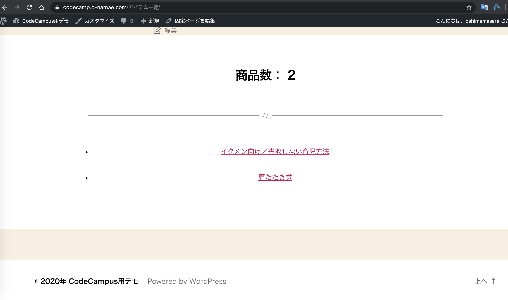

# wordpress-stripe-plugin-list-theme-file
WordPressのプラグイン Stripe 商品一覧ページがエラーなので、とりあえず一覧だけを表示するページ（テンプレ）を作成

https://codecamp.o-namae.com/%E3%82%A2%E3%82%A4%E3%83%86%E3%83%A0%E4%B8%80%E8%A6%A7/

Plugin  Stripe Payments(2.0.28)
Error   商品サムネイル用のデータベースが作成されていない、プラグインの更新を待つか、独自に作成するか

だったら Stripe API で一覧表示する方が早そう、ただし comporser 管理に
